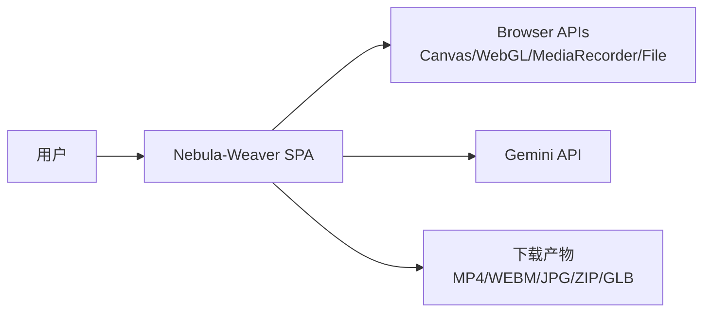

# 系统全景规格重建（Reverse-Engineered Spec）

## A. 系统规格总览
### 1) 项目目标与定位
- [事实] 系统当前是一个浏览器端“创意媒体工具工作台”，聚合 4 个工具：Nebula Weaver、Model Studio、Photo Shrink、Photo Framer。
  - 证据：`App.tsx:402-407, 422-450`。
- [推断] 系统定位是“单页内切换的多媒体处理实验平台”，并非只做单一 Nebula 功能。
- [事实] README 叙述聚焦 Nebula，但代码实现已扩展到多工具。
  - 证据：`README.md` vs `App.tsx`。
  - 冲突说明：README 与代码存在范围不一致，应以代码为准。

### 2) 目标用户 / 调用方 / 系统边界
- 目标用户
  - [推断] 主要是设计/内容生产者、3D 资产处理者、图片批处理用户。
- 调用方
  - [事实] 直接调用方为浏览器终端用户，无外部后端调用方。
- 系统边界
  - [事实] 计算主要在浏览器完成（Canvas/three/MediaRecorder）。
  - [事实] 仅 AI 分析依赖外部 Gemini API（`services/geminiService.ts`）。

### 3) 核心能力（按当前实现）
- [事实] Nebula：上传图像、AI命名+描述、星点检测、粒子动画预览、视频导出。
- [事实] Photo Framer：批量图片装裱预览、批量导出（可 ZIP）。
- [事实] Model Studio：导入多格式 3D、图层属性调整、组合导出 GLB。
- [事实] Photo Shrink：批量图片压缩到目标体积并下载。

### 4) 非核心但必要支撑能力
- [事实] 移动端适配（断点下侧栏收折、录制参数降级）。
- [事实] 长任务反馈（进度条、状态标签、错误收集）。
- [事实] URL/Canvas 资源管理（局部 revoke 与 canvas cleanup）。

### 5) 关键约束
- 性能
  - [事实] 大量依赖主线程图形计算；存在 1.4MB 单 chunk 警告。
- 状态一致性
  - [事实] 局部 useState 为主，跨工具不共享状态；依赖组件内顺序更新。
- 安全
  - [事实] API Key 通过前端构建注入，属于前端可提取风险面。
- 可用性
  - [事实] 无自动化测试与 CI；稳定性靠人工回归。
- 部署
  - [事实] 静态构建可部署；仓库内无平台专属部署配置。
- 平台限制
  - [事实] 导出与图形能力受浏览器 API 支持差异影响（MediaRecorder/MIME/OffscreenCanvas）。

## B. 核心业务能力
1. Nebula 影像转动态星云短片
- [事实] 主流程：上传 -> AI 识别/分析 + 星点检测 -> Canvas 动画 -> 录制下载。
2. 批量装裱与归档
- [事实] 支持逐图编辑、全量导出、压缩打包。
3. 3D 场景拼装与轻量编辑
- [事实] 支持图层显隐、颜色/透明度/位移/缩放、父子绑定（Pro 模式）。
4. 目标体积压缩
- [事实] 以质量二分 + 降尺寸兜底达成体积目标。

## C. 系统边界与外部依赖
- 本系统
  - [事实] React 前端应用，处理 UI 状态、文件输入输出、图像与 3D 渲染。
- 外部系统
  - [事实] Gemini API（图像理解）。
  - [事实] 浏览器原生能力（File/Canvas/WebGL/MediaRecorder/Blob）。
- 输入
  - [事实] 用户本地文件（图片/3D模型）、UI 参数。
- 输出
  - [事实] 下载文件（视频、图片、ZIP、GLB）。

### 系统上下文图（文字版）

## D. 核心场景列表（从现有实现倒推）
1. [事实] 多张星云图批处理分析并分别生成动画。
2. [事实] 摄影作品批量加框并导出压缩包。
3. [事实] 多 3D 资产组合、调色、导出单一 GLB。
4. [事实] 多图批量压缩到统一目标上限。

## E. 关键对象与状态
- [事实] `BatchItem`：Nebula 输入项与分析/检测状态。
- [事实] `FramedImage` + `FrameConfig` + `ImageEditConfig`：装裱域核心状态。
- [事实] `ModelStudioItem` + `ViewerConfig`：3D 图层与查看器状态。
- [事实] `CompressorItem` + `CompressionSettings`：压缩批处理状态。

## F. 现状能力矩阵（已实现 vs 可能缺失）
| 能力 | 当前实现 | 缺口/备注 |
|---|---|---|
| Nebula AI 识别与分析 | [事实] 已实现 | [待验证] 模型版本 `gemini-3-flash-preview` 的长期可用性 |
| Nebula 视频导出多格式 | [事实] UI可选 `webm/mp4/mkv/mov` | [事实] 下载名固定 `.mp4`，与实际格式可能不一致（`App.tsx:261`） |
| Motion Photo/Live Photo 导出 | [事实] `exportService` 提供函数 | [事实] 未在任何组件调用 |
| Photo Framer 批处理与取消 | [事实] 已实现 | [推断] 仍在主线程渲染，超大批量可能卡顿 |
| 3D 导入与编辑 | [事实] 已实现 | [事实] `viewerConfig.environment` 未被渲染逻辑消费 |
| 压缩目标控制 | [事实] 已实现 | [事实] `preserveMetadata/maintainAspectRatio` 未进入服务逻辑 |
| 工程质量保障 | [事实] 无测试/无CI | [事实] 回归依赖人工 |

## G. 未确认事项
- [NEEDS CLARIFICATION] 生产部署平台及环境变量注入路径（Vercel/其他）。
- [待验证] 是否需要后续支持账号体系、云存储或任务持久化。
- [待验证] 目标用户群与优先工具（当前看是多工具并行）。
- [待验证] `exportService` 是否是未来路线还是遗留未接通代码。

---

## H. 阶段摘要包（紧凑版）
- 系统定位：[事实] 浏览器端多媒体工具工作台，不是单功能 Nebula 应用。
- 服务对象：[推断] 内容创作者/图像与3D处理用户。
- 核心能力：[事实] Nebula动态渲染、PhotoFramer批处理、ModelStudio导入编辑、PhotoShrink压缩。
- 关键约束：[事实] 前端重计算 + 无测试CI + 浏览器 API 差异。
- 代码与 README 冲突：[事实] README 仅描述 Nebula；代码已实现 4 工具。
- 主要待确认：[待验证] 部署平台与长期演进方向。
- 下一阶段建议读取目标：`03_Module_Deep_Dive.md`。
